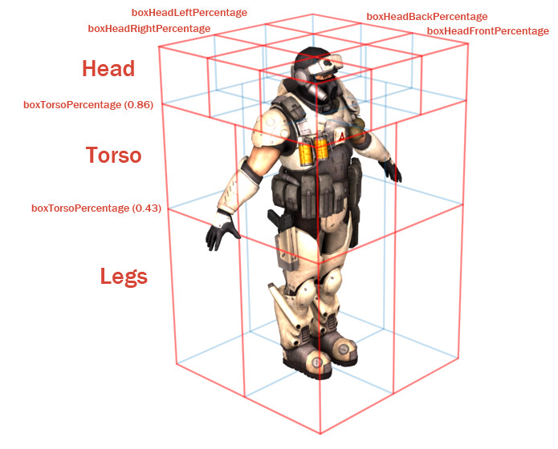

Rigging a Player Character
==========================

The purpose of this guide is to show how to rig and export a character for use in Torque 3D. This guide assumes that you are creating a new rig and animations from scratch and are not reusing any already existing rig or library of animations.

Already created animations will only work when applied to the rig they where created for. If you for example want to reuse the animation sequences that ships with the Torque 3D demo character, then you need to set up the rig for your new character exactly the same. However, this guide will not cover that specific case.

Deciding what rigs are necessary and setting them up should typically be done during technical pre-production of your game. Once it is done they should not be changed as that would mean re-targeting or in worst case re-creating all your animations.

How many and what type of rigs you need depend on your project. Are all your characters bipedal? Or do you also need to do quadrupedal animation as well? Will you use the same bipedal rig for all characters, player as well as all non-player characters? In some games you want a rig of higher fidelity for the hero player character, simpler rigs for the non-player characters and possibly a couple of special biped rigs for some monsters.

However, each rig you decide to create need its own library of animation sequences. Thus you can not share animations between say the hero rig and the non-player rig unless you set them up very carefully. For example you can set up the hero rig to be the exact same rig as the non-player but with some additional joints for any separate and additional animation.

With sharing animations in mind you should carefully name the rig and its components so that they apear logical in all skinned mesh files as well as sequence animation files.

Assets
------

Your game shapes should live in a directory somewhere under the *art/shapes* directory. You should create a new directory for each character. It will normaly hold the following files:

materials.cs
	All the material definitions for the character.

character.cs
	The TSShapeConstructor definition for the character.

character.dae
	Collada file with the characters rigged and skinned mesh.

character_d.dds
	The diffuse texture map for the character.

character_n.dds
	The normal map for the character.

character_s.dds
	The specular map for the character.

The exact naming convention of the mesh and texture files are entierly up to you as you export them from your 3D and 2D applications. While the script files are automatically generated by the Shape Editor upon importing the character mesh.

It is also recommended that you create a directory for all the animation sequences somewhere under the *art* directory. Each animation sequence should be stored in a separate DAE file. It's important to note that the characters skinned mesh need to use the same rig as the animation sequence files to be able to play them back.

Hierarchy
---------

Torque expects for each type of shape a number of specific nodes to be present depending on the shape class. The Player class require thus the following nodes acting as mount points:

cam
	Used as 3rd person camera position.

eye
	Used as 1st person camera position.

ear
	Where the SFX listener is mounted.

mount0-31
	You can have up to 32 mount nodes that is used to mount objects to the character.

Further the Player class expects a number of nodes acting as bones in an armature. The following nodes are used by the Player class for look, aim and recoil animations if no special sequences has specified by you for those actions (see Sequences). The naming convention for those nodes were taken from 3ds Max Biped and are therefore already present if the character is rigged in 3ds Max:

Bip01_Pelvis
	Hierarchial node (usually a bone) that act as the root.

Bip01_Spine
	Hierarchial node (usually a bone) whose parent is Bip01_Pelvis.

Bip01_Spine1
	Hierarchial node (usually a bone) whose parent is Bip01_Spine.

Bip01_Spine2
	Hierarchial node (usually a bone) whose parent is Bip01_Spine1.

Bip01_Neck
	Hierarchial node (usually a bone) whose parent is Bip01_Spine2.

Bip01_Head
	Hierarchial node (usually a bone) whose parent is Bip01_Neck.

The hierarchy should also contain axis-aligned bounding box mesh named *bounds* that fits around the shape at the root level that is used to define the shapes origin, determine which shape level to render and define the speed that the shape is intended to be moving at.

Lastly the hierarchy should contain one or more skinned meshes of the actual character shape. The number of meshes depend on the number of detail levels used. How to name the meshes is up to you, as long as you put the detail size as a number at the end of the mesh name.

While most nodes are optional, the shape will still load and run without a particular node or sequence, the object may not perform correctly in-game. However, a minimal rig for the Player class could look like this::

  + Bip01
  | + Bip01_Pelvis
  | | + Bip01_Spine
  | |   + Bip01_Spine1
  | |     + Bip01_Spine2
  | |       + Bip01_Neck
  | |         + Bip01_Head
  | + cam
  | + eye
  | + ear
  | + mesh0
  + bounds

Nodes for arms should normally be connected to the Bip01_Neck node and legs to the Bip01_Spine node. It is also recommended to add meshes of several detail levels, depending on the complexity of your mesh.

Level of detail
---------------

Level-of-Detail (LOD) is an extremely important concept to master in order to produce a great looking game that plays smoothly on low/mid-range hardware. Essentially, it involves rendering successively less complex versions of a shape in order to improve performance. 

The metric used to control LOD is the estimated size in pixels of the shapes bounding box on screen. As the shape gets further from the camera it will become smaller on screen, and a simpler version of the mesh may be rendered without loss of fidelity. Before rendering the shape, Torque estimates how large it would appear on-screen and selects the mesh, or meshes, of the appropriate detail level to be rendered. 

Only a mesh with a detail level equal or higher to the estimated size will be considered. Note that detail levels with negative sizes will never be chosen for rendering. Once the estimated size is less than the smallest positive detail size, no geometry will be rendered for the shape. You can force a shape to always render something by making the smallest positive detail level have a size of zero.

The level of detail size is expressed as a number put at the end of the mesh name. The LOD type should be set to "TrailingNumber" in the Shape Editor when you import the shape.

Bounding box
------------

Every shape includes an axis-aligned bounding box. This box appears around the shape when it is selected in the World Editor, and can be used for simple collision detection or mouse-hit picking. The bounding box is also used to determine which shape detail level to render and optionally to define the speed that the shape is intended to be moving at. The size of the bounding box is not fixed to the shape geometry. The modeler is free to define a custom bounding box extent for an object. This is done prior to export from the 3D application by creating a cube mesh called *bounds* with the appropriate dimensions.

If the exported DAE file does not contain a root level node called bounds with geometry attached to it, the Collada importer will automatically calculate a bounding box that encloses all of the geometry in the scene. For animated models, only the root (non-animated) pose is considered, but a walking character animation may move the feet or arms of the model outside the box containing the shape in its root pose, so use a custom bounding box to explicitly specify the bounding box extents.

Ground transform
----------------

Animation sequences that move the character should also include a ground transform. This tells the engine how fast the character would move along the ground when the animation is played back at normal speed. In the case of a Player object, this allows Torque to scale the animation playback speed to match the in-game speed that the Player is moving. For example, if the model was animated such that it would normally move at 3 units per second, but in-game was moving at 6 units per second, then the animation can be played back at double speed so the feet do not look like they are skating along the ground. Another use for ground transforms is to automatically switch between walking and running animations based on the in-game velocity of the Player.

The exact details of how to export ground transforms will depend on the 3D application. In general, the animation should be created so the character moves through space, rather than running or walking in-place. Animate the *bounds* node to move with the character so there is no translation relative to the bounds node. On export, the ground transform is determined by subtracting the movement of the bounds node from the walking or running animation so that it will play in-place in Torque 3D.

The ground transform information can also be set in the shapes script file (not yet available in Shape Editor UI) by using the setSequenceGroundSpeed member method on the shape object.

Mounts
------

Objects in Torque may be mounted to other objects, such as a Player riding a WheeledVehicle or a weapon placed in the player's hands. Usually the object to be mounted has a node named *mountPoint.* A weapon will be mounted in the player model's hand at node *mount0.* The *mountPoint* node is not essential however, if not present the mounted object's origin is used as the mount point.

Hitboxes
--------

Currently, the player's hitbox defined by their bounding box. In order to get damage locations we have cut the player's world box up into pieces as defined by the following sections in the Player's datablock:

* boundingBox
* boxHeadPercentage
* boxTorsoPercentage
* boxHeadLeftPercentage
* boxHeadRightPercentage
* boxHeadBackPercentage
* boxHeadFrontPercentage

The player's boundingBox determines the length in each dimension the bounding box should encompass. From the standard player datablock, its sections would look like the following:

It may be easiest to come up with these numbers by taking a render of the player, and using an imaging program to determine what percentage of the player makes up their legs/head/torso.

Sequences
---------

Player characters can be setup to use different weapon animations and share those animations between different skinned meshes with the same skeleton hierarchy. A character can have Collada files for the character’s skinned mesh and skinned skeleton as well as for the character’s animations with just the skeleton for each weapon pose. The animations can either be exported individually or combined in one DAE file that is split up through the Shape Editor.

Just as like with nodes the Player class also make use of a number of animation sequences to work properly in the game:

head
	Vertical head movement blend animation, start frame is fully up and end frame is fully down. Usually implementd as a 9 frame animation that only affects the neck and head nodes.

headside
	Horizontal head movement blend animation, start frame is full left and end frame is full right. Usually implemented as a 9 frame animation that only affects the neck and head nodes.

look
	Vertical arm movement blend animation, start frame is fully up and end frame is fully down. Usually implemented as a 9 frame animation that only affects the spine.

light_recoil
	Player has been hit lightly.

medium_recoil
	Player has been hit moderately hard.

heavy_recoil
	Player has been hit hard.

root
	Looped idle animation, just the character standing and breathing.

run
	Looped running forward animation.

back
	Looped runing backward animation.

side
	Character side stepping to the right. This looped animation will be played in reverse when moving to the left.

crouch_root
	Looped crouched idle animation.

crouch_forward
	Looped crouched forward walk animation.
	
crouch_backward
	Looped crouched backward walk animation.

crouch_side
	Looped crouched right movement animation. Will be played in reverse when moving to the left.

prone_root
	Looped idle animation of player lying down and not moving.

prone_forward
	Looped animation of player lying down and moving forward.

prone_backward
	Looped animation of player lying down and moving backward.

prone_side
	Looped animation of player lying down and moving to the right. Will be played in reverse when moving to the left.

swim_root
	Looped treading water animation.

swim_forward
	Looped animation of swimming forward.

swim_backward
	Looped animation of swimming backward.

swim_right
	Looped swiming right animation.

swim_left
	Looped swiming left animation.

fall
	Looped falling animation.
	
jump
	Character jump up from a moving start animation.

standjump
	Character jump up from a standing start animation.

land
	Character landing animation after falling or jumping.

jet
	Looped jetting animation.

reload
	Reloading the weapon blend animation.

sitting
	Looped animation of character sitting in a vehicle.

death#
	Where *#* is can be a number for multiple death sequences that will be picked randomly.

A number of these animation sequences are optional.

You add the animations through the Shape Editor by going to sequence tab labeled *Seq* and click on the new sequence icon and a file browsing dialog will open. Select the sequence Collada file you want. Now define the time range that you want by changing the numbers at the beginning and end of the timeline. Complete this process for each sequence that you wish to add.

Blends
------

Blend animations allow additive animation on the node structure of the shape. These will not conflict with other threads, and can be played on top of the node animation contained in other threads; such animations are relative. Blends only store the changes that occur over the course of the animation and not the absolute position of the nodes. This means that if a node is transformed by a blend animation, it includes only the transform information for that node, and it will add that transformation on top of the existing position in the base shape. Common uses for blend animations are facial expressions, head turning or nodding, and arm aiming.

Bear in mind that a blend can be played as a normal sequence, or it can be played on top of other sequences. When another sequence is playing, it will alter the root position, and the blend will be applied on top of that.

If you try to do a blend sequence where the root position is different than the 'normal' root (in the default root animation), you might expect that the blend will blend it to the new root (the position the character is positioned in during the blend animation). However, it does not work this way. Since nothing would actually be animating, it doesn't move the bones to the new position. What is contained in the blend sequence is only transform offsets from the blend sequence root position. Thus it is not a good idea to have a different root position in your 'normal' animations and your blends, as they can easily get out of sync!

The values added from the blend animation are based on the root position in the Collada file. This root position does not have to be the beginning of the animation. You can pick any position for the blend animation to reference. This is useful, because you can have a blend animation that can have a reference position that is the 'root' position. For animation like hip twists and arm movements (as in the 'look' animation), the character can be in a natural default state. In this way, you can have one animation control the character through the base pose to an extreme in either direction while referencing the default 'base' state, which will exist somewhere in the middle of the blend animation.

Threads
-------

Animation threads allow multiple sequences to play at the same time on a single shape. For example, a "headside" animation could rotate the player's head to look at something at the same time as a running animation is playing. Each animation sequence is played using a thread. Threads for non-blend sequences are applied first (in order of increasing priority), then blend sequence threads are applied on top (in order of increasing priority). The following rules determine what happens when more than one thread controls the same node in the shape:

#. If two non-blend sequences control the same node, the sequence with higher priority will animate it.
#. If two non-blend sequences with the same priority control the same node, the thread that was created last will animate it.
#. Blend sequences are applied on top of any previous thread, so if two blend sequences control the same node, both will animate it (applied in order of increasing priority, or thread creation order if priority is the same).

Triggers
--------

Triggers are arbitrary markers that can be used to call events on specific frames in a sequence. For example, a trigger can be responsible for generating footstep sounds and footprints when the feet hit the ground during walk and run animations. There can be up to 30 independent trigger states each with their respective on (1 to 30) and off (-1 to -30) states. You decide what each of those trigger states means. You should work with your programmer to define what the trigger states mean and how you should use them.

For example, you could have one trigger for each foot of a character that creates a footprint when the foot is down on the ground. Let's say that a triggerState of 1 is the left foot down and a triggerState of 2 is the right foot down. When the sequence plays the frame during which the left foot touches the ground, you could have a trigger on that frame that has a triggerState of 1 to create a footprint. You would then create another trigger with a triggerState of 2 for the right foot. You don't necessarily need to turn off the footprints (let's assume that the programmer will turn them off when it is necessary), but you could by creating two more triggers with triggerStates -1 and -2.
