GUI Editor Interface
====================

Running the GUI Editor
-----------------------

You can run Torque 3D's GUI Editor using one of two ways. In the main menu you can click "Launch GUI Editor":

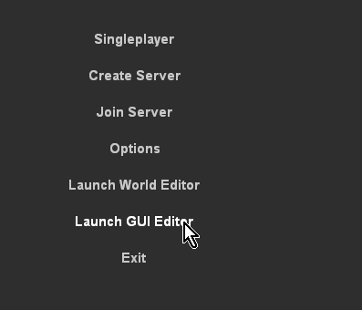

Once you have started GUI the editor you can begin editing. From here, you can edit your selected GUI, load a different GUI, or create an entirely new one. You can also open the GUI Editor by pressing the shortcut key while running a game: Windows users press F10, OS X users press cmd + F10.

Main Editor Sections
---------------------

The main GUI Editor view consists of 5 primary sections:

* **File Menu** - Found at the very top, this is where you will find various menus that controls global functionality of the editor, such as creating/saving GUI files, manually locking, selecting, and aligning controls, toggle snapping, and so on.

* **The Toolbar** - Located just below the File Menu, this bar contains shortcuts to the GUI Selector, resolution adjuster, and common positioning actions (nudge, align, etc). 

* **GUI Tab** - This panel, GUI Tree Panel, contains all of the controls that make up your current GUI. They are listed in hierarchical tree, which is organized from top to bottom and parenting (described later).

* **Library Tab** - The Library contains all of the controls you can add to your current GUI. You can click a control in the list or manually drag it to a position in the view to add it to the scene.

* **GUI Inspector Panel** - This panel, found directly below the GUI Tree Panel, is populated with all the properties that make up the currently selected GUI control. Most of your field editing will be performed here.

* **Profiles Tab** - List of all the GUI profiles.

* **GUI View** - The main canvas view of your GUI.

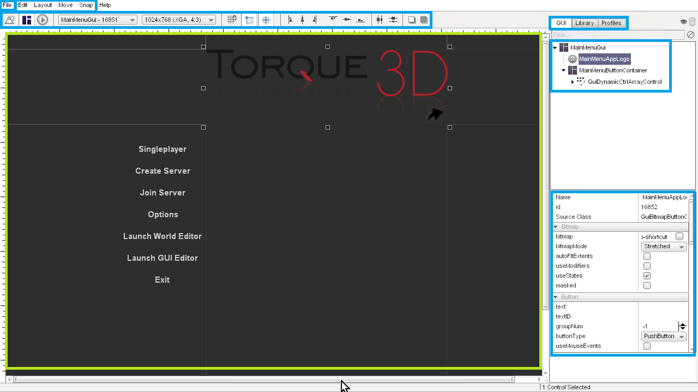

Menu Bar
---------

**File Menu** allows you to create, save, and open GUI files. You can also revert GUIs or load from file. 

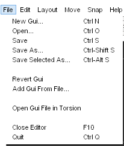

**Edit Menu** controls various editor actions, such as undo and redo.

The second function allows you to cut/copy/paste/delete objects you have selected.

Finally, this is the menu that allows you to perform selection and group actions, such as toggling visibility and locking. 

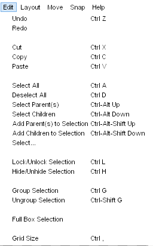

The **Layout Menu** contains actions that makes it easy for you align your GUI controls for a clean and neat appearance.

This is very useful for a complex interface with multiple controls that stack vertically or horizontally. 

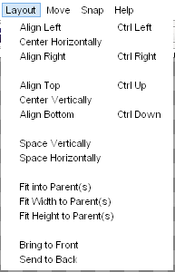

When you need to perform very subtle and precise movements on a GUI control, you can use the actions listed in the **Move Menu**.

Each nudge is assigned a shortcut, so using this menu is optional. 

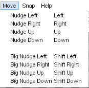

When dragging GUI controls with your mouse, using the **Snap Menu** toggles will cause your mouse to immediately jump to specific points (depending on the toggle). 

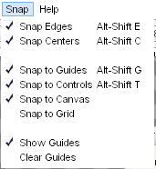

The **help menu** contains shortcuts to documentation and forums for Torque 3D. (right now without use)

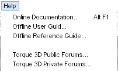

Tool Bar
---------

The most useful and preferred shortcuts for quick edits can be found in the Tool Bar. While most of your control properties will be edited in the Inspector, you can use the Tool Bar to perform quick positioning actions and testing.

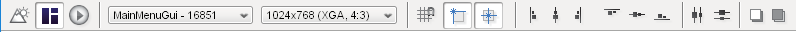

The first three icons toggle the editors, and are always available. The left most icon (looks like a mountain) toggles the World Editor. The next one (boxes) toggles the GUI Editor. The Play icon will exit the editors and let you play through the game. 

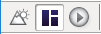

Next to the editor toggles, you will find two extremely important settings. These two are drop down lists that determine what you are editing and at what resolution.

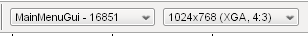

The first drop down is a list of every single GUI available to edit, including new ones you just created. You can jump to an individual GUI at anytime, which can be useful if you are editing multiple GUIs that which work together. 

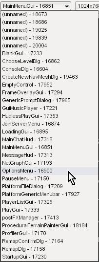

The second drop down list contains different resolutions you can build your GUI in:

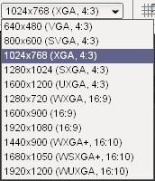

The next set of icons allow you to toggle the most commonly used and important settings for snapping:

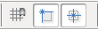

After the snapping icons, several shortcuts are available toggle the alignment of controls: 

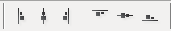

The next two icons, which look like multiple boxes attached to lines, are used when you have multiple GUI controls selected. These distribution toggles will equally space the GUIs you currently have selected:

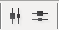

The final two icons in the the Tool Bar can move the currently selected GUI between layers. The first button will move the selected GUI ahead in a layer, bringing it closer to view. The second button will start shoving your GUI behind others, obscuring it from view:

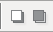

Library Tab
------------
The Control Palette contains all of the controls you can add to your current GUI. You can click a control in the list or manually drag it to a position in the view to add it to the scene.

When you click on the library tab, you can get list of all the GUI controls based on their functionality:

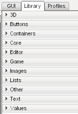

The categories are straight forward and should be an excellent way to get to the exact controls you need to build your interface. To see what a category contains, just click on one of the arrows or text to expand it:

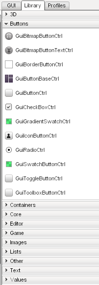

To add a control, locate it in the Library's list:

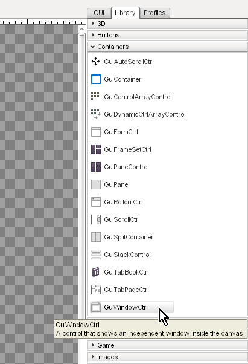

Next, click on the control and drag it to your main view using a mouse:

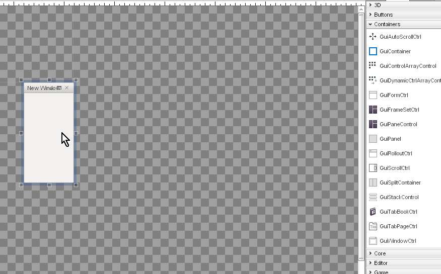

When you let go of your mouse button, you new control will anchor to the view and become your current selection:

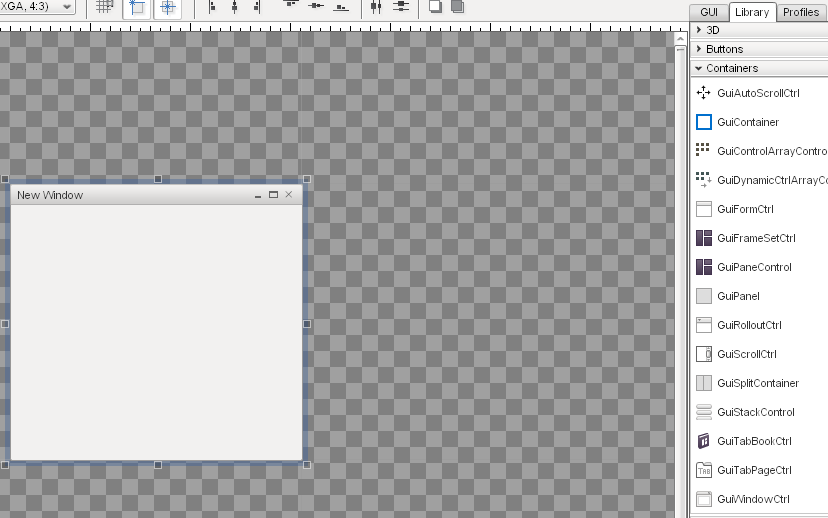

GUI Tree View
--------------

Every control added to your current GUI is kept in a sorted list. To view this list, click the "GUI" tab. This will list all of your controls in the order they were added, the most recent at the bottom of the list. Each control has a unique ID, and can be given a name.

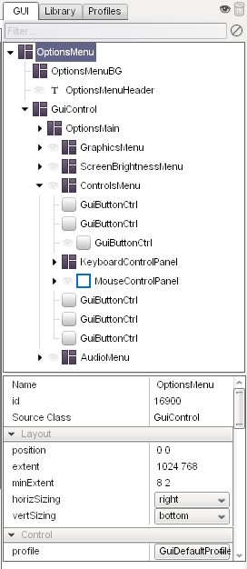

Profile Editor
---------------

In the same panel as the GUI Tree View, there is a tab called "Profiles." Clicking this tab will present you with a list of all the GUI profiles currently loaded by your game. GUI profiles contain data that personalizes your controls. This will allow you tailor an interface unique to your game.

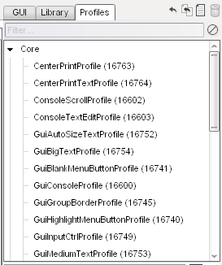

GUI Inspector
--------------

When you have a control or profile selected, the GUI inspector will be populated with the properties that make up the selection. These are the values that play an important role in assigning functionality to your GUI. Most of your editing will occur here.

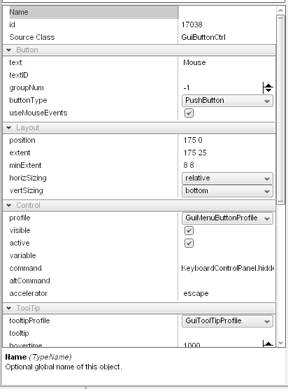

Selection and Parenting
------------------------

The last portion of the interface is how controls are selected. The following image shows the stock options GUI from the Full template that ships with Torque 3D. This consists of dozens of controls working together to make up the audio and video options:

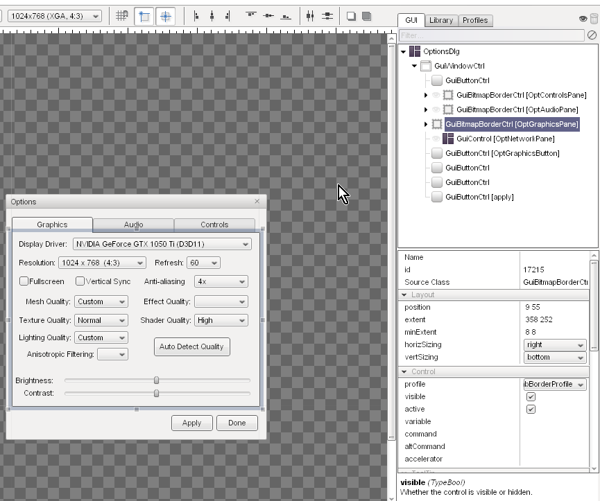

In the above image, I have selected the list box control that shows the display driver for a video card. The current selection is marked by six boxes surrounding the corners of the control, and several subtle lines. However, you should notice there is a large blue box surrounding multiple controls.

The large blue box shows the Parent control. When a control is the “parent”, it can contain multiple sub-controls. The “children” controls will now adhere to the same behaviors as the parent control. For example, if the parent control is set to invisible, the children controls will become invisible as well. If the parent is moved, all the children controls will move with it.
