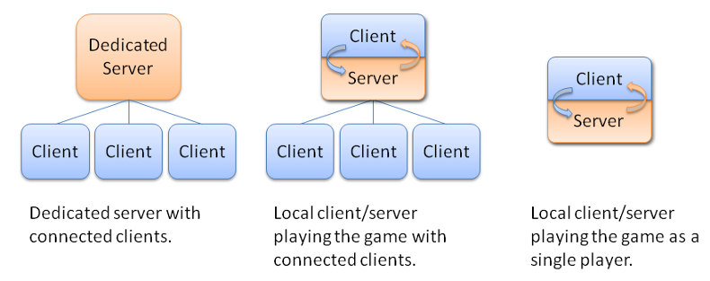
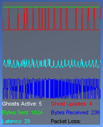

Network
=======

Classes and functions related Torque 3D networking.

Description
-----------

Torque was designed from the foundation up to offer robust client/server networked simulations. Performance over the internet drove the design for the networking model. Torque attempts to deal with three fundamental problems of network simulation programming: limited bandwidth, packet loss and latency.

An instance of Torque can be set up as a dedicated server, a client, or both a client and a server. If the game is a client and a server, it still behaves as a client connected to a server - instead of using the network, however, the NetConnection object has a short-circuit link to another NetConnection object in the same application instance. This is known as a local connection.

Handling Limited Bandwidth
~~~~~~~~~~~~~~~~~~~~~~~~~~

Bandwidth is a problem because in the large, open environments that Torque allows, and with the large number of clients that the engine supports (depending on amount of data sent per client, game world complexity, and available bandwidth), potentially many different objects can be moving and updating at once.

Torque uses three main strategies to maximize available bandwidth. First, it prioritizes data, sending updates to what is most "important" to a client at a greater frequency than it updates data that is less important. Second, it sends only data that is necessary. Using the BitStream class, only the absolute minimum number of bits needed for a given piece of data will be sent. Also, when object state changes, Torque only sends the part of the object state that changed. Last, Torque caches common strings (NetStringTable) and data (SimDataBlock) so that they only need to be transmitted once.

Handling Packet Loss
~~~~~~~~~~~~~~~~~~~~

Packet loss is a problem because the information in lost data packets must somehow be retransmitted, yet in many cases the data in the dropped packet, if resent directly, will be stale by the time it gets to the client.

.. image:: images/networkingPacketLoss.png

For example, suppose that packet 2 contains a position update for a player and packet 3 contains a more recent position update for that same player. If packet 2 is dropped but packet 3 makes it across to the client, the engine shouldn't resend the data that was in packet 2. It is older than the version that was received by the client. In order to minimize data that gets resent unnecessarily, the engine classifies data into five groups:

* Unguaranteed Data (NetEvent) - If this data is lost, don't re-transmit it. An example of this type of data could be real-time voice traffic. By the time it is resent subsequent voice segments will already have played.

* Guaranteed Data (NetEvent) - If this data is lost, resend it. This is good for important, one-time information, like which team the player is on, or mission end messages are all examples of guaranteed data.

* Guaranteed Ordered Data (NetEvent) - If this data is lost, not only resend it, but make sure it arrives in the correct order. Chat messages, and messages for players joining and leaving the game all examples of guaranteed, ordered data. In the diagram above, packet 5 arrives before packet 4. If these consist of guaranteed ordered data, the client will not process packet 5 until packet 4 is first handled.

* Most-Recent State Data (NetObject) - Only the most current version of the data is important. If an update is lost, send the current state, unless it has been sent already. Most scene objects transmit their information in this manner.

* Guaranteed Quickest Data (Move) - Critical data that must get through as soon as possible. An example of this is movement information from the client to the server, which is transmitted with every packet by the Move Manager.

Handling Latency
~~~~~~~~~~~~~~~~

Latency is a problem in the simulation because the network delay in information transfer (which, for modems, can be up to a quarter of a second or more) makes the client's view of the world perpetually out-of-sync with the server.

Twitch FPS games, for which Torque was initially designed, require instant control response in order to feel anything but sluggish. Also, fast moving objects can be difficult for highly latent players to hit. In order to solve these problems Torque employs several strategies:

* Interpolation is used to smoothly move an object from where the client thinks it is to where the server says it is.

* Extrapolation is used to guess where the object is going based on its state and rules of movement.

* Prediction is used to form an educated guess about where an object is going based on rules of movement and client input.

The network architecture is layered: at the bottom is the platform layer, above that the notify protocol layer, followed by the NetConnection object and event management layer.

On Ghosting and Scoping
~~~~~~~~~~~~~~~~~~~~~~~

One of the most powerful aspects of Torque's networking code is its support for ghosting and prioritized, most-recent-state network updates. The way this works is a bit complex, but it is immensely efficient. Let's run through the steps that the server goes through for each client in this part of Torque's networking:

* First, the server determines what objects are in-scope for the client. This is done by calling onCameraScopeQuery() on the object which is considered the "scope" object. This is usually the player object, but it can be something else. (For instance, the current vehicle, or an object we're remote controlling.)

* Second, it ghosts them to the client. A ghost is the client's representation of the server's object, and only maintains data that the client requires for the simulation. Ghosts come and go on the client according to the scope rules in the first step above.

* Finally, the server sends updates as needed, by checking the dirty list and packing updates. By only sending dirty data and using bit packing, no excess bandwidth is wasted. The order of ghost updates and their frequency is prioritized by the results of the object's getUpdatePriority() method.

Each object ghosted is assigned a ghost ID; the client is only aware of the ghost ID. This acts to enhance game security, as it becomes difficult to map objects from one connection to another, or to reliably identify objects from ID alone. IDs are also reassigned based on need, making it hard to track objects that have fallen out of scope (as any object which the player shouldn't see would).

NetConnection::resolveGhostID() is used on the client side, and NetConnection::resolveObjectFromGhostIndex() on the server side, to turn ghost IDs into object references. NetConnection::getGhostID() is used in the other direction to determine an object's ghost ID based on its SimObject ID. There is a cap on the maximum number of ghosts per client. Ghost IDs are currently sent via a 12-bit field, ergo, there is a cap of 4096 objects ghosted per client. This can be easily raised; see the GhostConstants enum in the source code.

.. seealso::

	NetObject for a further description of ghosting and individual objects.

NetConnection Group
~~~~~~~~~~~~~~~~~~~

The NetConnection is a SimGroup. On the client side, it contains all the objects which have been ghosted to that client. On the server side, it is empty. It can be used (typically in script) to hold objects related to the connection. For instance, you might place an observation camera in the NetConnnection, or the current Player obejct. In both cases, when the connection is destroyed, so are the contained objects.

.. seealso::

	NetConnection, the basis for implementing a multiplayer game protocol. Also see NetObject, which is the superclass for ghostable objects, and ShapeBase, which is the base for player and vehicle classes.

Local Connections
~~~~~~~~~~~~~~~~~

It is possible to run both the server and client within the same process. This is typically done while developing your multiplayer game, and is often required when using Torque's built-in world creation tools. This is also how a single player game is run. Having both a server and client together is known as a local connection.

Any time a player launches the game and chooses to host a mission, they are also making use of a local connection. All other players joining the game use a regular, networked connection, and are considered clients.

Internally, a local connection short-circuits the networking layer and allows for data to pass immediately between the internal server and client. However, it should be noted that there is still the additional overhead of having seperate server and client branches within the code, even when creating a single player game. When developing your single player game, you need to be mindful that a client and server still exist within the engine.

.. seealso::

	NetConnection, the basis for implementing a multiplayer game protocol.

Monitoring the Network
~~~~~~~~~~~~~~~~~~~~~~

If you are interested in seeing Torque's various network statistics, use the Net Graph.

The Net Graph is from a client, or ServerConnection, point of view. To activate the Net Graph, either press the 'n' key, or open the console and type 'toggleNetGraph();'. The Net Graph presents a number of networking statistics, as described below:

* Ghosts Active - The number of active ghosts on the connection.
* Ghost Updates - The total number of ghosts added, removed or updated since the last update.
* Bytes Sent - The total number of bytes sent to the server since the last update.
* Bytes Received - The total number of bytes received from the server since the last update.
* Latency - The average round trip time (in ms) for the connection. Also known as ping.
* Packet Loss - The percentage of packets lost since the last update.

Classes
-------

.. toctree::
	:maxdepth: 1

	class/AIClient
	class/AIConnection
	class/GameConnection
	class/HTTPObject
	class/NetConnection
	class/NetObject
	class/SimpleMessageEvent
	class/SimpleNetObject
	class/TCPObject
	class/BanList

Functions
---------

.. cpp:function:: string addTaggedString(string str)

	Use the addTaggedString function to tag a new string and add it to the NetStringTable.

	:param str: The string to be tagged and placed in the NetStringTable. Tagging ignores case, so tagging the same string (excluding case differences) will be ignored as a duplicated tag.

	:return: Returns a string( containing a numeric value) equivalent to the string ID for the newly tagged string

.. cpp:function:: string buildTaggedString(string format,  ...)

	Build a string using the specified tagged string format. This function takes an already tagged string (passed in as a tagged string ID) and one or more additional strings. If the tagged string contains argument tags that range from %1 through %9, then each additional string will be substituted into the tagged string. The final (non-tagged) combined string will be returned. The maximum length of the tagged string plus any inserted additional strings is 511 characters.

	:param format: A tagged string ID that contains zero or more argument tags, in the form of %1 through %9.
	:param ...: A variable number of arguments that are insterted into the tagged string based on the argument tags within the format string.

	:return: An ordinary string that is a combination of the original tagged string with any additional strings passed in inserted in place of each argument tag. 

	Example::

		// Create a tagged string with argument tags
		%taggedStringID = addTaggedString("Welcome %1 to the game!");
		
		// Some point later, combine the tagged string with some other string
		%string = buildTaggedString(%taggedStringID, %playerName);
		echo(%string);

.. cpp:function:: void closeNetPort()

	Closes the current network port.

.. cpp:function:: void commandToClient(NetConnection client, string func,  ...)

	Send a command from the server to the client.

	:param client: The numeric ID of a client GameConnection
	:param func: Name of the client function being called
	:param ...: Various parameters being passed to client command

	Example::

		// Set up the client command.  Needs to be executed on the client, such as
		// within scripts/client/client.cs
		// Update the Ammo Counter with current ammo, if not any then hide the counter.
		function clientCmdSetAmmoAmountHud(%amount)
		{
		   if (!%amount)
		     AmmoAmount.setVisible(false);
		   else
		   {
		     AmmoAmount.setVisible(true);
		     AmmoAmount.setText("Ammo: "@%amount);
		   }
		}
		
		// Call it from a server function.  
		// Needs to be executed on the server, 
		// such as within scripts/server/game.cs
		function GameConnection::setAmmoAmountHud(%client, %amount)
		{
		   commandToClient(%client, SetAmmoAmountHud, %amount);
		}

.. cpp:function:: void commandToServer(string func,  ...)

	Send a command to the server.

	:param func: Name of the server command being called
	:param ...: Various parameters being passed to server command

	Example::

		// Create a standard function.  
		// Needs to be executed on the client, such 
		// as within scripts/client/default.bind.cs
		function toggleCamera(%val)
		{
		   // If key was down, call a server command named ToggleCamera
		   if (%val)
		      commandToServer(ToggleCamera);
		}
		
		// Server command being called from above.  Needs to be executed on the 
		// server, such as within scripts/server/commands.cs
		function serverCmdToggleCamera(%client)
		{
		   if (%client.getControlObject() == %client.player)
		   {
		     %client.camera.setVelocity("0 0 0");
		     %control = %client.camera;
		   }
		   else
		   {
		     %client.player.setVelocity("0 0 0");
		     %control = %client.player;
		  }
		   %client.setControlObject(%control);
		   clientCmdSyncEditorGui();
		}

.. cpp:function:: string detag(string str)

	Returns the string from a tag string. Should only be used within the context of a function that receives a tagged string, and is not meant to be used outside of this context. Use getTaggedString() to convert a tagged string ID back into a regular string at any time.

	Example::

		// From scripts/client/message.cs
		function clientCmdChatMessage(%sender, %voice, %pitch, %msgString, %a1, %a2, %a3, %a4, %a5, %a6, %a7, %a8, %a9, %a10)
		{
		   onChatMessage(detag(%msgString), %voice, %pitch);
		}

.. cpp:function:: void DNetSetLogging(bool enabled)

	Enables logging of the connection protocols. When enabled a lot of network debugging information is sent to the console.

	:param enabled: True to enable, false to disable

.. cpp:function:: void dumpNetStats()

	Dumps network statistics for each class to the console. The returned avg , min and max values are in bits sent per update. The num value is the total number of events collected.

.. cpp:function:: void dumpNetStringTable()

	Dump the current contents of the networked string table to the console. The results are returned in three columns. The first column is the network string ID. The second column is the string itself. The third column is the reference count to the network string.

.. cpp:function:: string getTag(string textTagString)

	Extracts the tag from a tagged string. Should only be used within the context of a function that receives a tagged string, and is not meant to be used outside of this context.

	:param textTagString: The tagged string to extract.

	:return: The tag ID of the string. 

.. cpp:function:: string getTaggedString(string tag)

	Use the getTaggedString function to convert a tag to a string. This is not the same as detag() which can only be used within the context of a function that receives a tag. This function can be used any time and anywhere to convert a tag to a string.

	:param tag: A numeric tag ID.

	:return: The string as found in the Net String table. 

.. cpp:function:: void onDataBlockObjectReceived(int index, int total)

	Called on the client each time a datablock has been received. This callback is typically used to notify the player of how far along in the datablock download process they are.

	:param index: The index of the datablock just received.
	:param total: The total number of datablocks to be received.

.. cpp:function:: void onLightManagerActivate(string name)

	A callback called by the engine when a light manager is activated.

	:param name: The name of the light manager being activated.

.. cpp:function:: void onLightManagerDeactivate(string name)

	A callback called by the engine when a light manager is deactivated.

	:param name: The name of the light manager being deactivated.

.. cpp:function:: void pathOnMissionLoadDone()

	Load all Path information from the mission. This function is usually called from the loadMissionStage2() server-side function after the mission file has loaded. Internally it places all Paths into the server's PathManager. From this point the Paths are ready for transmission to the clients.

	Example::

		// Inform the engine to load all Path information from the mission.
		pathOnMissionLoadDone();

.. cpp:function:: void removeTaggedString(int tag)

	Remove a tagged string from the Net String Table.

	:param tag: The tag associated with the string

.. cpp:function:: bool setNetPort(int port, bool bind)

	Set the network port for the game to use.

	:param port: The port to use.
	:param bind: True if bind() should be called on the port.

	:return: True if the port was successfully opened. This will trigger a windows firewall prompt. If you don't have firewall tunneling tech you can set this to false to avoid the prompt. 

Variables
---------

.. cpp:member:: void  allowConnections

	Sets whether or not the global NetInterface allows connections from remote hosts. allowConnections(bool allow);

	:param allow: Set to true to allow remote connections.

.. cpp:member:: int $pref::Net::LagThreshold

	How long between received packets before the client is considered as lagging (in ms). This is used by GameConnection to determine if the client is lagging. If the client is indeed lagging, setLagIcon() is called to inform the user in some way. i.e. display an icon on screen.

.. cpp:member:: int $Stats::netBitsReceived

	The number of bytes received during the last packet process operation.

.. cpp:member:: int $Stats::netBitsSent

	The number of bytes sent during the last packet send operation.

.. cpp:member:: int $Stats::netGhostUpdates

	The total number of ghosts added, removed, and/or updated on the client during the last packet process operation.

.. cpp:member:: int $pref::Net::PacketRateToClient

	Sets how often packets are sent from the server to a client. It is possible to control how often packets may be sent to the clients. This may be used to throttle the amount of bandwidth being used, but should be adjusted with caution. The actual formula used to calculate the delay between sending packets to a client is:

.. cpp:member:: int $pref::Net::PacketRateToServer

	Sets how often packets are sent from the client to the server. It is possible to control how often packets may be sent to the server. This may be used to throttle the amount of bandwidth being used, but should be adjusted with caution. The actual formula used to calculate the delay between sending packets to the server is:

.. cpp:member:: int $pref::Net::PacketSize

	Sets the maximum size in bytes an individual network packet may be. It is possible to control how large each individual network packet may be. Increasing its size from the default allows for more data to be sent on each network send. However, this value should be changed with caution as too large a value will cause packets to be split up by the networking platform or hardware, which is something Torque cannot handle. A minimum packet size of 100 bytes is enforced in the source code. There is no enforced maximum. The default value is 200 bytes.
