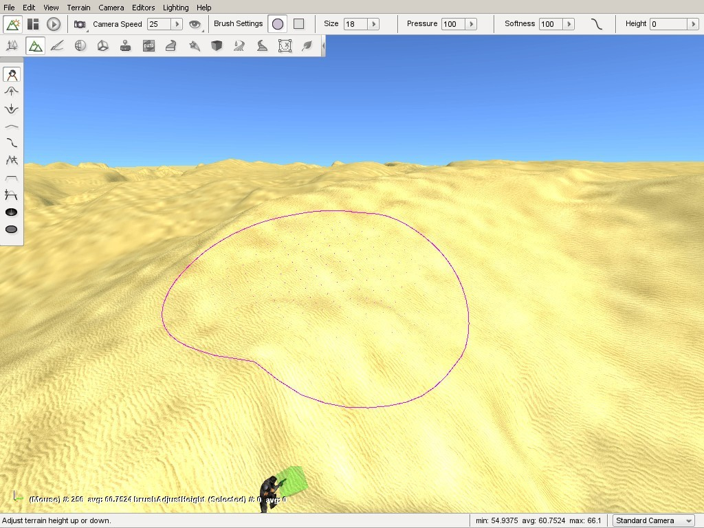

Terrain Editor
==============

The Terrain Editor is used to modify a TerrainBlock's surface in real time within the World Editor.

With the Terrain Editor, you can elevate, excavate, smooth, flatten, and randomize sections of your terrain as if you were painting on the ground with a simple set of brushes. This is a great way to add the final details and polish to your level before populating it with objects.

The Terrain Editor is a powerful tool and allows for more than just adding hills or holes. You can cut channels for rivers, generate valleys for a mountainous region, turn a rocky mountain chain into a series of smooth hills, and other similar advanced operations.

Interface
---------

To switch to the Terrain Editor press the F2 key or from the main menu select Editors > Terrain Editor.

There are three main areas of the interface. On the far left is the tool palette, which is used to select what kind of modification you wish to make.

Grab Terrain
	Allows you to manually raise or lower terrain under brush.

Raise Height 
	Adds dirt to terrain beneath brush, thus elevating it.

Lower Height
	Excavates terrain below brush, thus lowering it and creating holes.

Smooth
	Smooths jagged terrain beneath brush, creating more rounded elevation.

Smooth Slope
	Smooth slopes in terrain.

Paint Noise
	Creates random divots, elevation, and depressions under brush. Used for adding detail.

Flatten
	Flattens terrain, elevated or excavated, to the level of brush's starting point.

Set Height
	Set terrain to fixed height.

Clear Terrain
	Make holes in terrain.

Restore Terrain
	Cover holes in terrain made with the Clear Terrain tool.

At the top, the Toolbar has updated to show various brush options. The brush options will change the intensity and pattern of your terrain modification.

Shape
	Toggles between a round or square brush.

Size
	Changes the size of the grid that makes up the brush, increasing or decreasing the amount of terrain being modified.

Pressure
	Determines the amount of modification being applied to the terrain.

Softness
	Determines how much of the brush is affected by the pressure and intensity.

Softness Curve
	Customize how softness is applied.

Height
	The brush starting height.

Finally, while moving the mouse over the terrain, you will see a circle drawn around the mouse cursor. This is the Terrain Editor brush and is controlled by your mouse. You can use this brush to "paint" your terrain adjustments by left clicking and dragging the cursor.

Brush Settings
--------------

Now we will go into deeper explanation of how the brush options can affect your terrain editing, and how the editor lets you know what you are doing. On the toolbar at the top of the screen, find the Brush Settings section.

Shape
~~~~~

You should see a circular icon and square icon. Toggling between the two will change the shape of your brush.

Size
~~~~

In the Size section you will find a box with a number in it. When you click on the arrow, a slider will appear. This slider goes from 0 to 100, and it changes the size of your brush allowing it to modify larger sections of the terrain.

Pressure
~~~~~~~~

The Pressure setting is a decimal number ranging from 0.0 to 100.0, and determines how much change is applied to the terrain under the brush.

The easiest way to understand brush pressure is to think of using a real paintbrush on a piece of paper. The harder you press as you stroke, the more paint the brush will leave on the paper. Pressing lightly but going over and over the same spot again and again will also leave more paint behind.

Since you can not press harder or softer on the terrain with a mouse button the Pressure value lets you simulate how much affect the brush has when you are "painting" terrain changes. The higher the Pressure setting, the more dramatic the change will be under the brush over time.

For example: select the Raise Height tool; set the Pressure to 1; place the mouse over the terrain; then quickly press the mouse button and release it. You will see the terrain slightly rise under the brush. Now change the Pressure to 100 and click elsewhere on the terrain in the same manner. You will see the terrain under the brush rise much more quickly and higher than during the first operation.

Like a real paintbrush, our terrain brush left more change behind because its pressure was greater. The same change can be accomplished by clicking the same spot on the terrain multiple times with a lower setting. The lower the setting, the more control you will have to make accurate changes to the terrain.

You will also notice that the ground rose higher in the center than around the edges of the brush. Again, this mimics the real world where the pressure around the edges of a paintbrush will be less because there are less bristles, which makes the edges of the brush softer than the center. Therefore the edges will leave less paint behind than the center.

Softness
~~~~~~~~

The Softness setting directly affects the intensity of the entire brush's surface. Like the others, it is represented by a slider. The number is a decimal value ranging between 0.0 and 100.0, with 100.0 being the softest and 0.0 the hardest.

The harder the brush is, the more dramatically the terrain under the brush will change. Think of a paint brush that has been dipped in paint and allowed to somewhat dry. The entire brush will be harder and thus will leave more paint behind than the same brush which has not dried and hardened. Since the entire brush has hardened the pattern that it leaves will be the same, that is more paint in the center and less at the edges, but the overall amount of paint will increase across the whole surface. If you allow the brush to completely dry then the entire brush will be the same hardness and thus will leave the same amount of paint across its entire surface.

Because you can not change the softness of a mouse cursor, the Terrain Editor provides the Softness settings to emulate these characteristics. Setting the softness to 0.0, meaning the brush has no softness at all, will result in the entire brush being hard. The edges will be just as hard as the center and so the entire brush will leave the same amount of change behind. The result will be in a sharp rise between the terrain and the brush edges, producing a cliff.

.. image:: terraineditor/ZeroSoftness.jpg

Conversely, if you set the brush to 100.0, meaning maximum softness the brush will exhibit its natural behaviour returning to very soft edges and a harder center. Setting the Softness to 100.00 (maximum softness) will cause the change at the edges to be much less dramatic than the change in the center and will result in a gentle rise from the edges to the center, producing a rolling hill.

.. image:: terraineditor/Softness100percent.jpg

Softness Curve
~~~~~~~~~~~~~~

The previous section discussed how changing the Softness affects the brush over its entire surface mimicking the natural effects of a brush which is harder in the center and softer at the edges due to the distribution of its bristles. The Brush Softness Curve allows you to customize this behaviour further by changing the way softness and hardness is distributed within the brush.

Click the curved line next to the brush Softness slider. The Brush Softness Curve dialog box will appear.

.. image:: terraineditor/StockBrushCurve.jpg

The graph contains multiple nodes which can be moved by clicking and dragging them up or down. Modifying the nodes will determine which parts of your brush are hard or soft. As the graph shows, going from left to right will determine where in the grid you are changing the hardness.

Left nodes are closer to the center of the brush, and each node moving to the right will move toward the outer edges of the brush. The higher a node is situated, the harder it is. The following image is a visual of how this system works:

.. image:: terraineditor/BrushCurveVisual.jpg

The circular pattern represents the shape of the brush looking straight on at its tip. Hardness of the brush is represented by red, softness by green, and yellow indicates variations in between. The node in the upper left represents the very center of the brush, since it is at the far left on the Inside-Outside axis. Because it is also at the very top of the Hard-Soft axis, it means that the brush is at its hardest at that location. So the combination of these two node positions indicates that the brush is at its hardest (indicated by red) in the very center.

On the other end of the graph line, the node in the lower right represents the very edge of the brush, since it is at the far right on the Inside-Outside axis. Because it is also at the very bottom of the Hard-Soft axis it means that the brush is at its softest at that location. So the combination of these two node positions indicates that the brush is at its softest (indicated by green) all around the edge.

If you were to drag each node so that the line is reversed, the brush will be softer toward the center and harder toward the edges.

.. image:: terraineditor/ReverseBrushCurveVisual.jpg

To get an unusual setting, you can create a "wavy" version of the curve. Alternating the nodes in extremes from top to bottom, will result in rings of softness with the brush.

.. image:: terraineditor/WavyBrushCurveVisual.jpg

Now that you are familiar with the interface, it is time to edit the terrain.

Grab Terrain Tool
-----------------

Let's start by selecting the Grab Terrain tool from the palette. With the Grab Terrain tool, you can move a section of terrain up or down depending on which direction you are dragging your mouse.

Use the circle brush, size 20, 100 pressure, and 100 softness. Hover your brush over a section of terrain, hold down the left mouse button, then move your mouse up. The terrain should dynamically adjust to your cursor location. 

.. image:: terraineditor/AdjustHeightBefore.jpg

When you are satisfied with the height, let go of the mouse to see your terrain modification.

.. image:: terraineditor/AdjustHeightAfter.jpg

Use the mouse to cover part of your new adjustment with the brush. Notice how the brush clamps to the terrain, maintaining the shape you are using while still selecting a section.

.. image:: terraineditor/BrushTerrainClamping.jpg

Despite the elevation of your current selection, the section under the hardest part of the brush will still adjust more dramatically. Using the default Softness Curve, if the center of the brush is just to the edge of a hill, you can adjust nearby terrain to match elevation. Terrain under the softer part of the brush will still elevate, but not as much.

.. image:: terraineditor/AdjustmentIntensity.jpg

Before moving on to the next tool, we will experiment with the softness value. Set the softness of your current brush to 1 (very hard). Move the brush over a flat section of the terrain.

.. image:: terraineditor/HardAdjustmentBefore.jpg

Click on the terrain and drag your mouse up. Instead of an elevated hill with a smooth slope, your brush should have created a flat plateau with completely vertical sides. With a softness of 1, your brush's shape will be used to extrude the terrain in a sharp manner.

.. image:: terraineditor/HardAdjustmentAfter.jpg

Raise Height Tool
-----------------

The Raise Height tool can only elevate the terrain, but it does so in a very controlled manner. Instead of manually lifting, you can "paint" the terrain in a sweeping motion by dragging the mouse while holding the left button. The longer you keep the brush in one location, the higher that section will be and the higher the Pressure setting, which was reviewed earlier, the faster it will change.

Set your brush size to 20, pressure to 40, and softness to 100. Find a flat section of the terrain and move your mouse cursor to that location to hover the brush.

.. image:: terraineditor/RaiseHeightBefore.jpg

When you are ready, click and hold the left mouse button and begin dragging your brush in a direction. The terrain should elevate wherever your brush passes over. You can use this to create a hill over a long section of terrain.

.. image:: terraineditor/RaiseHeightAfter.jpg

Using a lower brush pressure results in less dramatic terrain elevation as you "paint". This allows you to be more exact in cases where you need to.

Lower Height Tool
-----------------

The Lower Height tool functions completely opposite of the Raise Height tool. Instead of elevating, you can dig holes in the terrain with this tool. Again, use a circular brush with 20 size, 40 pressure, and 100 softness. With the Lower Height tool selected, locate a flat section of the terrain and hover your brush over it.

.. image:: terraineditor/ExcavateBefore.jpg

Click and hold down the left mouse button. As you do so, the terrain will sink down below the brush. If you sweep your mouse as if you are painting, you will create a path of lowered terrain. The longer you hold the mouse in a single location, the deeper the hole will be.

.. image:: terraineditor/ExcavateAfter.jpg

Smooth Tool
-----------

The Smooth tool erodes jagged terrain sections under the brush to create a smoother surface. This tool will only work if you sweep the brush across a surface. Simply holding down the left mouse button will have little to no effect.

Keeping the same settings we have been working, locate a jagged section of terrain. If you have to, create one with the Raise Height tool first. Make sure the elevation difference is significant. Select the Smooth tool then hover the brush over the applicable terrain.

.. image:: terraineditor/SmoothBefore.jpg

Click and hold the left mouse button, then make small circles around the peak of the terrain section. The tip should lower and have a broader surface. The broader your sweep, the more terrain is affected by the smoothing process.

.. image:: terraineditor/SmoothAfter.jpg

Paint Noise Tool
----------------

The Paint Noise tool is used to give your terrain modifications a more randomly defined look. The tool uses a noise algorithm for sporadic elevation and excavation. Essentially, it causes fluctuation in the amount of terrain it modifies and how intensely it changes.

Select the Paint Noise tool, then set your brush to size 15, 50 pressure, and 100 softness. Locate a large section of flat terrain and move your camera to a high elevation.

.. image:: terraineditor/AddNoiseBefore.jpg

Click and hold the left mouse button down then begin to "paint" the terrain by dragging it in random patterns. Try making several concentric circles, varying spirals, zig-zag motions, etc. You should eventually see some definition forming.

.. image:: terraineditor/AddNoiseAfter1.jpg

When you are finished with the tool, fly your camera around the section of the terrain to see how the terrain was affected. Keep in mind that most of these changes were random, which can add much needed detail to your terrain but can cause some weird effects. The Smooth tool can be used to go back and blend out any such effects that do not look natural.

.. image:: terraineditor/AddNoiseAfter2.jpg

You can use this tool on terrain that has already been modified to remove unrealistic adjustments, such as perfectly smooth or flat slopes.

Flatten Tool
------------

The Flatten tool is used to make the terrain surrounding the brush's starting point be equal to that points elevation. In other words, this either lower or raise your terrain to the same elevation as that starting point.

Use a circular brush with 15 size, 50 pressure, and 100 softness. Find a section of terrain that is elevated. Position your brush near it, but on a flatter section of the terrain.

.. image:: terraineditor/FlattenBefore.jpg

Click and hold your left mouse button, then drag it toward and over the elevated terrain until you have swept over most of it. You should see that the tool has flattened a strip of terrain, based on the brush's location as it swept. The flattening process will become weaker the further you take the brush into the higher terrain such that it will not cut a path that is exactly the elevation of the starting point but rather relative to it and the terrain you are crossing. If you sweep the Flatten tool slowly across a hilly terrain, you will see that it is well suited for specialized tasks such as creating road and rail beds or mountain passes. Creating these types of features can be accomplished using the other tools but this tool in particular makes that job much easier.

If you make several sweeps in the same direction, from the same starting point, your terrain will eventually smooth out into a flat plateau almost level with your original starting point.

.. image:: terraineditor/FlattenAfter2.jpg

This is generally handy for clearing a smooth path from one elevation to another. However, this is not the optimal approach for flattening huge sections of terrain. The other tools can perform that process much faster and more efficiently.

Set Height Tool
---------------

The Set Height tool will allow you to determine the exact height for the terrain brush. Use a circular brush with a size of 15, pressure of 50 and softness of 100, and a height of 520.

.. image:: terraineditor/SetHeightBefore.jpg

Now, when you press the left mouse button, it will create a plateau at exactly that height.

.. image:: terraineditor/SetHeightAfter.jpg

Clear Terrain Tool
------------------

The Clear Terrain tool will allow you to remove pieces of the terrain. This is an effective way to carve out entrances to caves. That way your artist can create a detailed cave level and your level editor can "carve" out an entrance in the terrain. Using the previous tools, create a small hillside.

.. image:: terraineditor/ClearTerrainStep1.jpg

Now, set your brush size to 5 and zoom into an area that looks like a promising cave entrance.

.. image:: terraineditor/ClearTerrainStep2.jpg

When you select the terrain area, it will remove the mesh data from the terrain, creating an opening.

.. image:: terraineditor/ClearTerrainStep3.jpg

Now you can place your cave model underneath the terrain so that the player can explore the world under your terrain.

Restore Terrain Tool
--------------------

The Restore Terrain tool complements the Clear Terrain tool. It will restore the mesh data for the terrain. That way, you can have better control over the transition between your models and terrains. If you select the Restore Terrain button and then left-click on the previously cleared area, you will see it restore the terrain to its previous state.

.. image:: terraineditor/ClearTerrainStep2.jpg

Conclusion
----------

In this article, you learned how to use the Terrain Editor. The power of this tool allows you to make broad, sweeping changes to your terrain or tiny detail adjustments to get it "just right."
