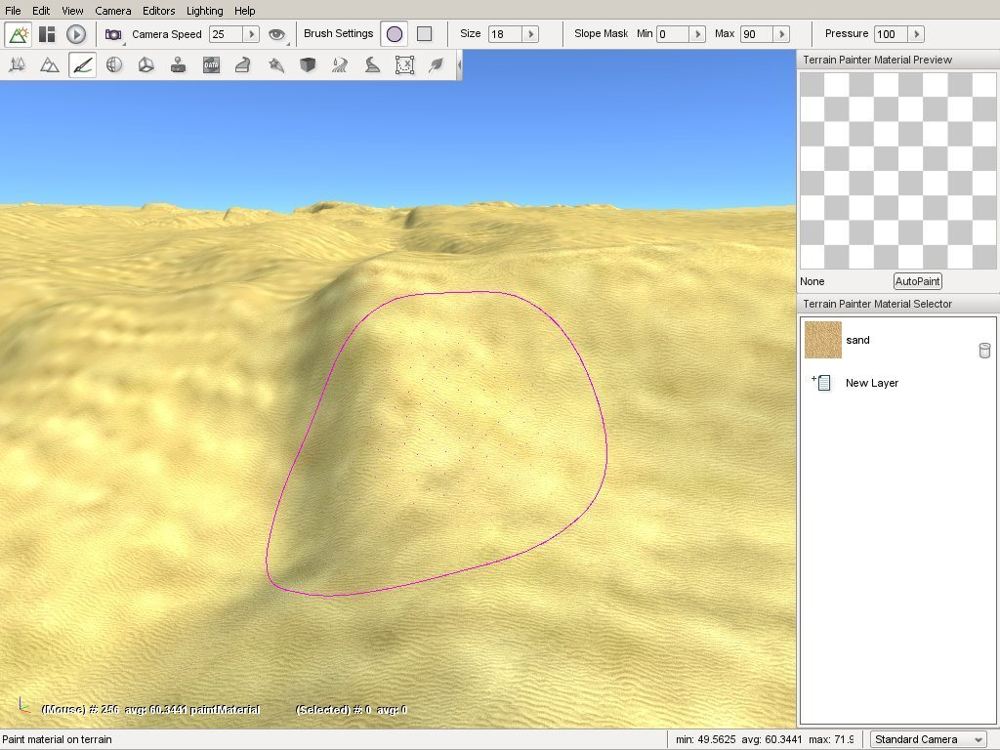

Terrain Painter
===============

Just as the name implies, the Terrain Painter is a tool built into Torque 3D's World Editor which allows you to paint your terrain with various materials, such as grass, dirt, rocks, and so on.

Like the rest of the editors, the Terrain Painter is a WYSIWYG editor. As you change your terrain materials and paint the surface, you can see what the changes will look like in real time as if you were playing your game.

You can use the Terrain Painter to make wide-spread modification to a blank terrain, or use finer and more detailed brushes to touch up imported terrain layers/textures. Let's get started by setting up your environment.

Interface
---------

To switch to the Terrain Editor press the F3 key or from the main menu select Editors > Terrain Painter.

There are four main areas of the interface you will focus on while using this tool.

The Brush
---------

Using the Terrain Painter is very similar to painting on a piece of paper with a brush except here you are painting on the terrain by dragging the mouse across the screen. Your brush is represented as a circle or a square in your scene's view. This visual outline allows you to know where your brush is located and what portion of the terrain it will affect when you move it.

.. image:: terrainpainter/PainterCircleBrush.jpg

The image shown above is displaying the default brush style when you first open the Terrain Painter. If you wish to change your brush type, you can modify it via the Brush Settings found in the Tool Settings toolbar at the top of the screen. Brush Settings are only active while using the Terrain Painter.

The image shown above is displaying the default brush style when you first open the Terrain Painter. If you wish to change your brush type, you can modify it via the Brush Settings found in the Tool Settings toolbar at the top of the screen. Brush Settings are only active while using the Terrain Painter.

.. image:: terrainpainter/PainterSquareBrush.jpg

You will find the Brush Size slider next to the shape settings. You can move the slider from left (smaller) to right (larger) to change the size. The stock value is typically small, usually a 9x9 grid. The more you increase the slider value, the greater the grid will grow. The change will add an equal number of rows and columns, as shown below.

.. image:: terrainpainter/PainterLargeBrush.jpg

You can find the Terrain Painter palette docked on the right side of the editor. This panel is similar to a traditional painter's palette in the real world. Instead of swatches of color, the Terrain Painter's palette is populated by TerrainMaterials which you use to paint the terrain.

.. image:: terrainpainter/PainterPalette.jpg

A TerrainMaterial is a collection of three textures combined into a single layer. The three textures are the base (also known as diffuse), detail, and normal map. A preview of which TerrainMaterial (or layer) is shown in the box at the top of the palette labeled Terrain Painter Material Preview.

Terrain Materials Editor
------------------------

When you wish to add a new TerrainMaterial, click on the New Layer entry in the palette. Once you click on the entry, the Terrain Materials Editor window will appear. This tool is completely separate from the basic Material Editor, as TerrainMaterials are structured and used much differently than other Torque 3D materials which are used on shapes in the world placed with the World Editor.

.. image:: terrainpainter/TerrainMaterialEditor.jpg

Terrain Materials
	The TerrainMaterials list contains all the currently available textures for creating terrain materials.

New Button
	Clicking the Page icon in the Terrain materials header creates a new TerrainMaterial entry for editing.

Delete Button
	Clicking the Trash can icon in the Terrain materials headerdeletes the currently selected TerrainMaterial.

Apply & Select Button
	Clicking this button closes the Terrain Materials Editor and returns to what ever operation brought you to the dialog, for the purposes of this article it returns you back to the Terrain Painter Material Selector and adds the selected TerrainMaterial as a new material ready to be used for painting.

Cancel Button
	Close editor without making a choice.

Clicking on an entry in the Terrain Materials list updates the Material Properties pane on the right to display the current properties of that material.

The Material Properties pane contains a Name field, which is used as the label assigned to the material and three sub-sections which describe the textures that define the material.

The Diffuse sub-section shows a preview and the properties of the materials Diffuse texture, which provides the color and base appearance of the material. The Diffuse texture is also commonly referred to as the Base texture for this reason.

The Detail sub-section shows a preview and the properties of the materials Detail Map, which gives the material a more defined, crisp look. If you are familiar with advanced rendering concepts this is accomplished using additive blending and per-layer fade distance techniques.

The Normal sub-section shows a preview and the properties of the materials Detail Map, which gives the material a more defined, crisp look. If you are familiar with advanced rendering concepts this is accomplished using additive blending and per-layer fade distance techniques.

Name
	Assigns the name of the TerrainMaterial which will appear in the Terrain Materials list.

Edit Button
	Clicking this button allows you to select the texture to assign to this aspect of the material.

Trash Can Button
	Clicking this button clears the texture that has been selected for this section.

Use Side Projection
	Terrain diffuse textures are normally applied top-down, which can result in stretching. This toggle causes a material to smoothly merge and conform to steep terrain if needed.

Diffuse Size
	Controls the physical size, in meters, of the base texture.

Detail Size
	How close the camera must be before the detail map begins rendering in meters.

Detail Distance
	Determines how bold the detail appears on the base texture.

Parallax Scale
	Adjusts the intensity of the parallax depth in normal maps.

Painting
--------

Before we begin painting, we will add a second TerrainMaterial to our palette (if the project you have open already has more than one feel free to skip this step).

To add a new material click the New Layer button in the Terrain Painter Material Selector. The Terrain Materials Editor will open. Click any TerrainMaterial in the list other than the one that is already in your palette, such as the "rocktest" material shown here.

.. image:: terrainpainter/TerrainMaterialEditor.jpg

Once you have the material selected, click the Apply & Select button. Once you have done this, the new layer will have been added to your palette and available for painting.

This is a good time to take a look behind the scenes to understand a little of how Torque 3D organizes materials and how it uses them for other operations to your advantage.What you can not see in the interface is that the system has associated each of the TerrainMaterials in your palette with a numbered layer. Throughout these documents you will see, or may have already seen, that material layers are used to control aspects of object placement such as which layer automatic object placement will occur on.

If you started with a project that was created with the Full template and added the rocktest material in the last step then the system now considersgrass1 to be layer0 and rocktest to be layer1. This allows you, whenever asked, to select layers using something meaningful to you rather than remembering some random numbering system. When asked to select a layer you can simply pick the grass or rocktest layer from a list and the system will use and apply the proper numbered layer to perform the related operation.

All this becomes very important in reducing the amount of work that is needed to create realistic terrain. The TerrainMaterials that you apply with the Terrain Painter tool not only give the terrain the appearance of natural materials but they can be used to automatically generate and restrict foliage and other shapes when used in conjunction with objects such as GroundCover.

.. image:: terrainpainter/PainterPaletteRocks.jpg

Now, on to learning to paint. Make sure you have the new material selected in the Terrain Painter Material Selector. So we can more easily see the modifications we are about to make, set your brush size to about 25. Now, find a section of the terrain you wish to paint. Here, we started in a corner of the TerrainBlock.

.. image:: terrainpainter/PaintRockBefore.jpg

Click and hold down the left mouse button, then begin dragging the brush around the screen in a sweeping motion. The terrain will update in real time to reflect the painting of the new TerrainMaterial. When you let go of the mouse button, the Terrain Painter will stop laying down the material.

.. image:: terrainpainter/PaintRockAfter.jpg

You should have noticed that your brush clamped to the terrain as long as the cursor was over the block. This happens regardless of any terrain modification or elevation occurring, as shown in the following example. Notice how the brush distorts to wrap around the elevated terrain.

.. image:: terrainpainter/PainterBrushClamping.jpg

Even though you just paved a large section of rock material, you can still paint over it. Decrease the Brush Size to approximately 9, so we can paint a more exact line of terrain. We are going to paint a path over our rocky area. In the Terrain Painter palette, select the first material (desert_sand_03 in this image).

.. image:: terrainpainter/SwitchToDesert.jpg

Now, using your mouse cursor move the brush to the edge of our rocky area. You can start it just before the rocky area, or even on top of it.

.. image:: terrainpainter/PaintPathBefore.jpg

Click and hold down the left mouse button to begin painting then sweep your mouse in a curving motion across the rocky area. When you are finished, let go of the mouse and examine or your winding path made of grass.

.. image:: terrainpainter/PaintPathAfter.jpg

If you were to drop down to the player's camera view, you can see where the two TerrainMaterials meet each other after editing.

.. image:: terrainpainter/PathCloseup.jpg

Take the time to experiment with different brush sizes and shapes to see what kind of patterns you can come up with. When you are ready, read on to learn how to add a new TerrainMaterial with higher quality and detail.
